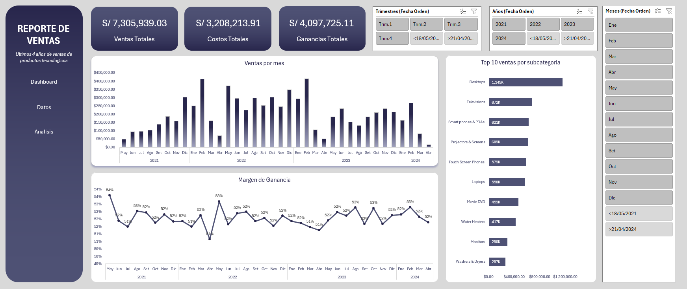

# Panel Analisis Ventas Productos Tecnologicos durante 4 años
Panel de control de ventas de productos tecnológicos en tiendas

## Descripción General 
Este repositorio contiene el Panel de Análisis de Ventas de Productos Tecnológicos, una herramienta basada en Excel diseñada para analizar y visualizar datos de ventas de los últimos 4 años(2021-2024). El panel ofrece información sobre indicadores clave de rendimiento (KPI), tendencias mensuales, top productos por subcategoría y márgenes de ganancia, facilitando la toma de decisiones basadas en datos para la gestión comercial.



## Características principales
- **Indicadores KPI:** Descripción general de ventas totales (S/ 7.3M), costos totales (S/ 3.2M) y ganancias totales (S/ 4.1M).
- **Análisis temporal:** Tendencias mensuales 2021-2024
- **Top 10 por productos:** Ranking de los 10 productos más vendidos
- **Margen de ganancia:** Seguimiento del margen promedio (52% constante (2021-2024)) a lo largo del período analizado.
- **Elementos interactivos:** Segmentadores y filtros para profundizar en subconjuntos de datos específicos.
- **Diseño intuitivo:** Diseño claro y secciones organizadas para una navegación intuitiva.

### Objetivo del proyecto
Analizar los datos de ventas de productos tecnológicos en tiendas durante 4 años para descubrir tendencias, identificar insights y utilizar decisiones basadas en datos para mejorar el rendimiento comercial.

### Objetivos del proyecto
- **Recopilación y preparación de datos:** Recopilar datos de ventas de productos tecnológicos por subcategoría y período. Depurar y formatear los datos para garantizar su precisión y consistencia.
- **Análisis de datos:** Realizar un análisis exploratorio de datos (EDA) para comprender la distribución y los patrones de ventas. Identificar los productos más vendidos (Top 10 por subcategoría), los períodos de mayor demanda y las tendencias de ventas estacionales.
- **Visualización y creación de dashboard:** Desarrollar un dashboard interactivo en Excel para visualizar el rendimiento de ventas. Incluir gráficos y tablas que resuman métricas clave como ventas totales (S/7.3M), costos totales (S/3.2M), ganancias totales (S/4.1M) y margen de ganancia (52%).
- **Insights y recomendaciones:** Obtener información útil a partir del análisis de datos. Generar recomendaciones para mejorar las estrategias de ventas, optimizar la gestión del inventario y dirigirse a segmentos específicos de productos.

## Pasos involucrados
1. **Recopilación y preparación de datos:** Importar datos de ventas a Excel desde las fuentes correspondientes. Limpiar los datos eliminando duplicados, gestionando valores faltantes y formateando fechas correctamente.
2. **Análisis de datos:** Calcular métricas como ventas totales, costos totales, ganancias y márgenes mediante funciones como SUMA, PROMEDIO, CONTAR, SI y BUSCARV. Utilizar tablas dinámicas para resumir datos por subcategoría de producto, mes y año.
3. **Visualización y creación del dashboard:** Diseñar un dashboard con secciones para KPIs principales, análisis de tendencias mensuales (2021-2024), Top 10 de productos por subcategoría y evolución del margen de ganancia. Incluir gráficos de líneas para tendencias, gráficos de barras para comparaciones y elementos interactivos como segmentadores para filtrar por año o categoría.
4. **Análisis y recomendaciones:** Analizar las tendencias de ventas, identificar los productos más vendidos (Desktops lidera con S/1.14M), los períodos de mayor venta (picos en febrero y diciembre) y las áreas de mejora. Ofrecer recomendaciones prácticas basadas en información basada en datos.

## Funciones y técnicas utilizadas
- **Manipulación de datos:** Funciones como ORDENAR, FILTRAR, SUMAR.SI, CONTAR.SI, PROMEDIO.SI, SI.ERROR para procesamiento y análisis de datos.
- **Tablas dinámicas:** Para resumir y analizar grandes conjuntos de datos, extrayendo información significativa por subcategoría, mes y año.
- **Gráficos y tablas:** Visualización de tendencias mensuales de ventas y ranking de productos para facilitar la toma de decisiones.
- **Formato condicional y validación de datos:** Para resaltar tendencias importantes (como picos de ventas) y garantizar la precisión de los datos mediante técnicas de formato y validación.

## Empezando
1. Clonar el repositorio:
   ```bash
   git clone https://github.com/tuusuario/Panel-Ventas-Productos-Tecnologicos-4anos.git
2. Abrir el archivo Excel (dashborad reporte de ventas productos tecnologicos.xlsx) en el repositorio.
3. Explorar el dashboard y utilizar las funciones interactivas para analizar los datos.

## Conclusión
Este proyecto aprovecha las capacidades avanzadas de Excel para analizar eficazmente los datos de ventas de productos tecnológicos durante 4 años (2021-2024). Siguiendo pasos estructurados y empleando las funciones y técnicas adecuadas, las partes interesadas pueden obtener información valiosa sobre el rendimiento de ventas, identificar los productos más rentables (como Desktops) y tomar decisiones empresariales informadas para el crecimiento y la mejora del negocio.
